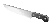

  

<h1 align="center">
  RETCH NEOSITE
</h1>

Welcome to the GitHub repo for my [Neocities](https://neocities.org) site.

## Prod Notes

- This site is based on the [Astro Cactus](https://github.com/chrismwilliams/astro-theme-cactus) theme.
- I use `bun` for package management.

| Command             | Action                                                    |
| :------------------ | :-------------------------------------------------------- |
| `bun install`       | Installs dependencies                                     |
| `bun run dev`       | Starts local dev server at `localhost:3000`               |
| `bun run build`     | Build site to `./dist/`                                   |
| `bun run postbuild` | Pagefind script to build the static search of blog posts  |
| `bun run preview`   | Preview build locally, before deploying                   |
| `bun run sync`      | Generate types based on config in `src/content/config.ts` |
